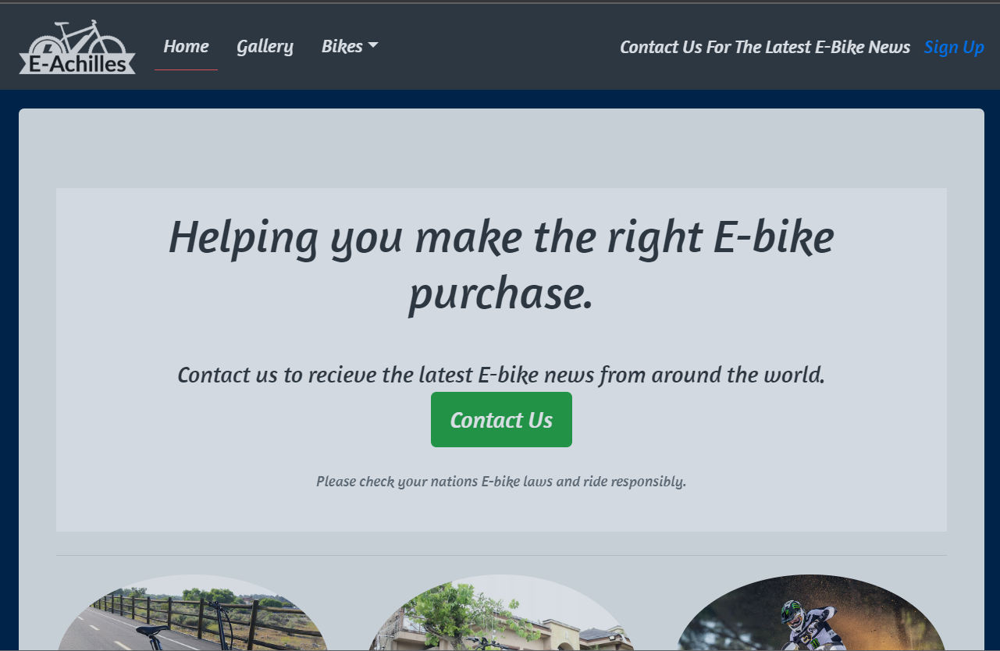

<h1 align="center">Achilles Ebikes</h1>

<a href="https://develogenics.github.io/Achilles-Ebikes/" rel="nofollow">View site here</a>

<h2 align="center">User Experience</h2>

E-Achilles website is for those who are thinking about purchasing an alectric bike, but do not know where to start. The site show various types of ebikes and informs the viewer what they are used for and if they are suitable for what the buyer requires. It shows the basics of 3 types of bikes on the index page, has various bikes and components on the gallery page, has a contact form so viewers can recieve the latest ebike news and ask for any advice in regards to any future purchases once subscribed. It also has external links in the navigation bar and under bike styles on the index page for information on various bikes in the three categories covered. The site offers easy navigation and is reponsive in any resolution on any device, the site was designed mobile first.

<h2 align="center">Design</h2>

Wireframes was designed using windows paint, it shows the different page layouts, how they will change with a mobile view, how the nav bar changes with a mobile view and how images stack in a mobile view.

<h3>Desk top view</h3>

<h3>Gallery view</h3>

<h3>Form view</h3>

<h3>Mobile view</h3>

<h3>Mobile menu view</h3>

<h2 align="center">Navigation</h2>

<h2 align="center">Page contents/h2>
  
<h3>Index</h3>

The index page puts across what the site is about. The page contains 3 styles of bikes with images and links to extrnal sites, it contains quotes with images and a video linking to youtube.
  
<h3>Gallery</h3>
  
The gallery contains images of various bikes and components there is a back to top button at the bottom to return to the top quickly.
  
<h3>Contact</h3>

The contact page has multiple required fields including radio buttons, the button links to code institute.
  
<h2 align="center">Navigation</h2>
  
The navigation bar was created using bootsrap, it contains links to three internal links, a drop down menu with 3 external links, a logo, and a hamburger menu when viewed on mobile devices.

<h2 align="center">Responsive Design</h2>

The website was designed with mobile first usage in mind. For the gallery media quires was used, for navigation and all other divs/sections etc bootstrap was used. Whene in mobile view, all items stack on top of each other and the navigation shrinks down into a hamburger menu, once clicked the nav bar desk top items now come into view stacked on top of each other.

  
<h2 align="center">Typography</h2>

The site use font-family 'Amaranth' and 'sans-serif' and is consitent across all pages.
  
<h2 align="center">Icons</h2>
  
The website uses icons for social media links in the footer, the quotes and on the form page.

<h2 align="center">Images</h2>
  
Images were taken from random google searches from random sites for various types of bikes, they were resized and cropped uisng photoshop.

<h2 align="center">Color scheme</h2>

The site uses consistent dark and light backgrounds for containers and fonts. It was kept simple in this project as the bootstrap standard light and dark contrast pass the contrast checker. the colors used in contrast for the main text and text backgrounds were bootstrap dark # 161C2D and bootstrap light # F1F4F8 in places the scheme was reversed like in the navbar. The site also had a background behind all text that was in jumbotron containers using boostrap, teh color used for this was #002349 

<h2 align="center">Validation</h2>

Fixed all errors for the css and html files and passed the validators, the contrast was checked and passed also.

  

  

  

  

  
<h2 align="center">Typography</h2>

